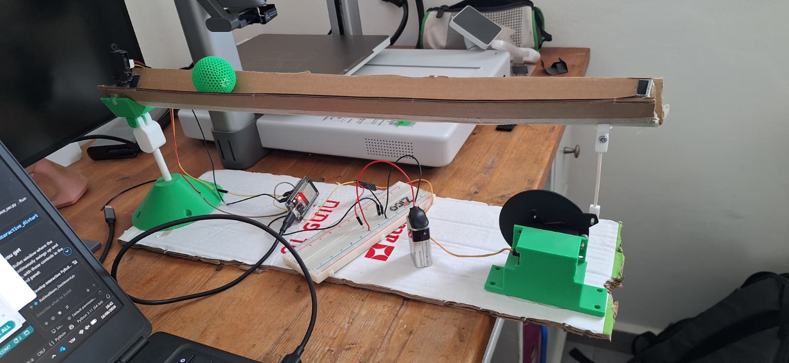
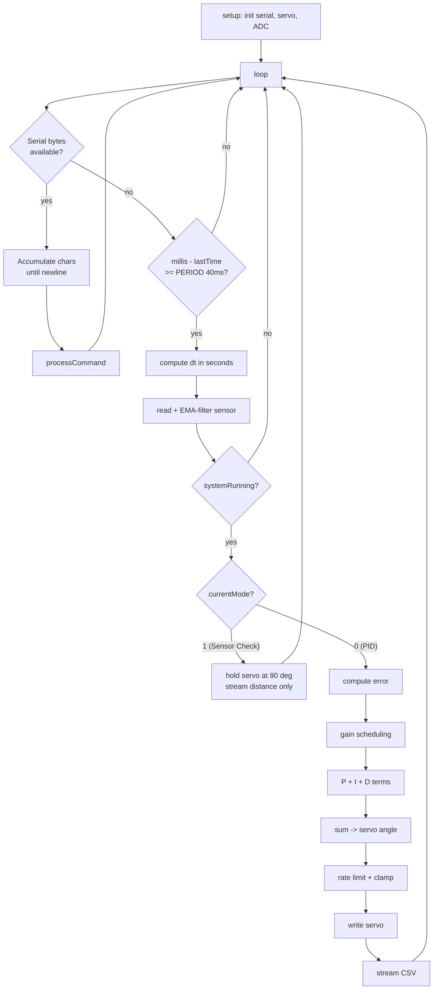

# Ball & Beam PID Controller — Algorithm & Flow Documentation

This document explains every algorithm and the control flow in
`BallAndBeam_PID/BallAndBeam_PID.ino`. The firmware runs on an **ESP32**, reads
ball position from a **Sharp GP2Y0A21YK0F IR distance sensor**, and tilts the
beam with an **MG-996R servo** to hold the ball at a commanded distance.

---

## 1. System Overview



The rig is a lightweight **cardboard channel beam** that pivots at its left end
on a 3D-printed bracket, with a green ball rolling freely along the channel. The
Sharp IR sensor sits at the **left end** pointing down the track to measure the
ball's distance; the MG-996R servo at the **right end** drives a pushrod linkage
that tilts the beam. The ESP32 and breadboard (center) run the control loop, and
the laptop runs the Python dashboard for live plotting and tuning.

```
  ┌────────────┐   distance (cm)   ┌──────────────┐   angle (deg)   ┌─────────┐
  │ IR Sensor  │ ────────────────▶ │  ESP32 (PID) │ ──────────────▶ │  Servo  │
  │ GP2Y0A21   │                   │  this sketch │                 │ MG-996R │
  └────────────┘                   └──────┬───────┘                 └────┬────┘
        ▲                                 │ CSV over USB serial            │
        │ ball position                   ▼                                │ tilts beam
        │                          ┌──────────────┐                        │
        └──────────────────────────│ Python Dash  │◀───────────────────────┘
              (physical loop)       │ (plot/tune)  │   commands (START/SET/KP…)
                                    └──────────────┘
```

The ball-and-beam plant is an **unstable double integrator**: tilt sets the
ball's *acceleration*, so position lags tilt by two integrations. This is why a
**derivative (D)** term is essential — it provides the phase lead needed to
stabilize the loop.

---

## 2. High-Level Control Flow



The loop is **non-blocking**: it never uses `delay()`. Serial parsing happens
every pass, but the control math only runs on a fixed **40 ms schedule**.

---

## 3. Timing — Fixed-Rate Scheduler

```cpp
const int PERIOD = 40;               // 40 ms = 25 Hz
if (now - lastTime >= PERIOD) { ... }
```

- The control loop runs at **25 Hz**, matched to the IR sensor's ~40 ms
  settling time (reading faster returns stale/transitioning data).
- Actual elapsed time is measured every cycle:

  ```cpp
  float dt = (now - lastTime) / 1000.0;  // seconds
  ```

  Using the **real `dt`** (instead of a hard-coded constant) makes the integral
  and derivative terms **independent of the loop rate**. If `PERIOD` changes, the
  tuning stays valid.

---

## 4. Sensor Pipeline

### 4.1 Raw reading — `get_dist_raw()`

```cpp
long sum = 0;
for (int i = 0; i < 3; i++) sum += analogRead(SENSOR_PIN);
float volts = (sum / 3.0) * (3.3 / 4095.0);
return constrain(29.988 * pow(volts, -1.173), 10.0, 80.0);
```

1. **3-sample average** of the 12-bit ADC (0–4095) knocks down high-frequency
   ADC noise.
2. Convert counts → volts (`3.3 V` reference, 12-bit).
3. **Power-law calibration** converts volts → centimeters:

   $$d = 29.988 \cdot V^{-1.173}$$

   This is the inverse of the Sharp sensor's non-linear voltage-vs-distance
   curve (closer object → higher voltage).
4. `constrain(..., 10, 80)` clamps to the sensor's valid range.

### 4.2 Exponential moving average (EMA) smoothing

```cpp
distance = ALPHA_SENSOR * raw + (1.0 - ALPHA_SENSOR) * distance;   // ALPHA_SENSOR = 0.7
```

A first-order low-pass filter. Each new reading contributes `ALPHA_SENSOR`
(70%), the running value keeps the rest. This is a trade-off:

| `ALPHA_SENSOR` | Behavior |
|----------------|----------|
| Closer to 1.0  | More responsive, more noise |
| Closer to 0.0  | Smoother, more lag |

The filter is **seeded** in `setup()` with a real reading so it doesn't ramp
from zero at startup.

---

## 5. The PID Algorithm

The controller output is expressed **directly in servo degrees** offset from the
beam-level position (90°). No `map()` rescaling is used.

### 5.1 Error

```cpp
distance_error = distance_setpoint - distance;   // cm
```

### 5.2 Gain Scheduling (adaptive gains)

Before computing the terms, the **base** gains (`kp`, `ki`, `kd`) are scaled by a
factor that depends on how far the ball is from the target:

```cpp
float t = (absErr - NEAR_THRESHOLD) / (FAR_THRESHOLD - NEAR_THRESHOLD);
t = constrain(t, 0.0, 1.0);
kp_eff = kp * (KP_NEAR + t * (KP_FAR - KP_NEAR));
kd_eff = kd * (KD_NEAR + t * (KD_FAR - KD_NEAR));
ki_eff = ki * (KI_NEAR + t * (KI_FAR - KI_NEAR));
```

`t` is a **normalized blend factor**:

- `t = 0` when the ball is **near** the setpoint (`|error| ≤ NEAR_THRESHOLD`).
- `t = 1` when the ball is **far** (`|error| ≥ FAR_THRESHOLD`).
- Between the thresholds it interpolates **linearly**.

The multipliers (current values):

| Term | NEAR (t=0) | FAR (t=1) | Rationale |
|------|-----------|-----------|-----------|
| `KP` | 0.7 | 1.1 | Push harder when far, calm near target (less overshoot) |
| `KD` | 0.9 | 1.0 | Keep strong damping near the setpoint |
| `KI` | 1.0 | 0.5 | Reduce integral when far to avoid **windup**; full authority near target for steady-state accuracy |

Effective gains are the ones actually applied **and** the ones logged to CSV, so
you can watch them change live. Toggle the whole feature with `SCHED ON` /
`SCHED OFF`.

### 5.3 Proportional

```cpp
PID_p = kp_eff * distance_error;   // degrees
```

Immediate push proportional to how far off the ball is. Units: degrees per cm.

### 5.4 Integral (with anti-windup)

```cpp
PID_i += ki_eff * distance_error * dt;              // accumulate over real time
PID_i = constrain(PID_i, -INTEGRAL_LIMIT, INTEGRAL_LIMIT);   // clamp ±30 deg
```

- Accumulates error over time to eliminate **steady-state offset**.
- Multiplying by `dt` gives it correct time units (degrees per cm·second).
- The `constrain()` is **anti-windup**: if the ball is stuck (e.g. an
  unreachable setpoint, or the servo saturated), the integral cannot grow without
  bound and cause a huge overshoot when the error finally clears.

### 5.5 Derivative (with low-pass filter)

```cpp
float raw_derivative = kd_eff * (distance_error - distance_previous_error) / dt;
derivative_filtered = ALPHA_DERIVATIVE * raw_derivative
                    + (1.0 - ALPHA_DERIVATIVE) * derivative_filtered;   // ALPHA_DERIVATIVE = 0.7
PID_d = derivative_filtered;
```

- Reacts to the **rate of change** of error — anticipates motion and brakes the
  ball before it overshoots. This is the term that stabilizes the double
  integrator.
- Raw differentiation amplifies sensor noise, so the result is passed through a
  second **EMA low-pass filter** (`ALPHA_DERIVATIVE`). Without it, the derivative
  term is jittery and makes the servo twitch.

### 5.6 Sum

```cpp
PID_total = PID_p + PID_i + PID_d;   // total correction in degrees
```

---

## 6. Actuator (Servo) Pipeline

### 6.1 Offset from level

```cpp
float servoAngle = 90.0 + PID_total;   // 90 deg = beam flat/level
```

### 6.2 Rate limiter — the key stability guard

```cpp
float servoStep = servoAngle - previousServoAngle;
servoStep = constrain(servoStep, -MAX_STEP_PER_CYCLE, MAX_STEP_PER_CYCLE);  // ±14 deg/cycle
servoAngle = previousServoAngle + servoStep;
```

Caps how far the servo command can move per 40 ms cycle. The value **14°/cycle**
(= 350°/s) is just under the MG-996R's real speed (~400°/s at 6 V).

> **Important:** This must match the servo's *actual* capability. Setting it too
> low (e.g. 3°/cycle) throttles the servo far below its real speed, adding phase
> lag that causes a **limit-cycle oscillation**. Setting it appropriately lets
> the derivative term work as intended.

### 6.3 Mechanical clamp

```cpp
servoAngle = constrain(servoAngle, SERVO_MIN, SERVO_MAX);   // 35–130 deg
previousServoAngle = servoAngle;
myservo.write((int)servoAngle);
```

Keeps the servo within the beam's safe mechanical travel and remembers the
commanded angle for next cycle's rate limiter.

---

## 7. Operational Modes

Selected by the `currentMode` variable (`MODE 0` / `MODE 1` serial commands):

| Mode | Name | Behavior |
|------|------|----------|
| **0** | Full PID Control | Runs the whole algorithm above (default on boot). |
| **1** | Sensor Sanity Check | Servo held at 90° (level). Only the distance is streamed, so you can validate sensor readings without the ball moving. PID math is skipped (`return`). |

---

## 8. Serial Protocol

### 8.1 Commands received (from Python) — `processCommand()`

Parsed line-by-line, case-insensitive:

| Command | Effect |
|---------|--------|
| `START` | Reset PID state (integral, derivative, previous error, servo tracker) and begin control |
| `STOP` | Stop control, return beam to level (90°) |
| `SET <cm>` | Change the target distance |
| `KP <val>` | Set base proportional gain live |
| `KI <val>` | Set base integral gain live |
| `KD <val>` | Set base derivative gain live |
| `SCHED ON` / `SCHED OFF` | Enable/disable gain scheduling |
| `MODE 0` / `MODE 1` | Switch to PID / Sensor-Check mode |

> **Clean-start detail:** `START` and `MODE 0` reset `PID_i`,
> `derivative_filtered`, `distance_previous_error`, and `previousServoAngle`, so
> control always resumes from a known state without stale accumulation.

### 8.2 Data streamed out (to Python)

Every control cycle emits one CSV line:

```
Distance, Setpoint, ServoAngle, Kp_eff, Ki_eff, Kd_eff
```

`Kp_eff/Ki_eff/Kd_eff` are the **post-scheduling** gains actually applied, so the
dashboard can plot how they adapt. In Sensor-Check mode the base gains are sent
with a dummy setpoint of 0.

---

## 9. Parameter Reference

| Constant | Value | Purpose |
|----------|-------|---------|
| `PERIOD` | 40 ms | Control loop period (25 Hz) |
| `kp / ki / kd` | 6.0 / 1.1 / 4.0 | Base PID gains (deg per cm, deg per cm·s, deg per cm/s) |
| `ALPHA_SENSOR` | 0.7 | Sensor EMA weight |
| `ALPHA_DERIVATIVE` | 0.7 | Derivative LPF weight |
| `INTEGRAL_LIMIT` | ±30° | Anti-windup clamp |
| `MAX_STEP_PER_CYCLE` | 14°/cycle | Servo slew-rate cap (match to servo speed!) |
| `SERVO_MIN / MAX` | 35 / 130 | Mechanical travel limits |
| `FAR_THRESHOLD` | 5 cm | Above this error → fully "far" gains |
| `NEAR_THRESHOLD` | 1 cm | Below this error → fully "near" gains |
| `KP/KD/KI_FAR/NEAR` | see §5.2 | Gain-scheduling multipliers |

---

## 10. Signal Flow Summary

```
setpoint ──▶(−)──▶ error ──▶ gain schedule ──▶ ┌─ P: kp·e ────────────┐
              ▲                                 ├─ I: Σ ki·e·dt (clamp)├─▶ Σ ─▶ 90°+ ─▶ rate-limit ─▶ clamp ─▶ servo
              │                                 └─ D: kd·Δe/dt (LPF) ──┘                                       │
              │                                                                                               ▼
           distance ◀── EMA filter ◀── cm calibration ◀── 3-sample ADC avg ◀── IR sensor ◀── ball on beam ◀──┘
```

Two filters (sensor EMA, derivative LPF), two safety clamps (integral windup,
servo rate/travel), and adaptive gains together turn a noisy, unstable plant
into a stable position controller.
